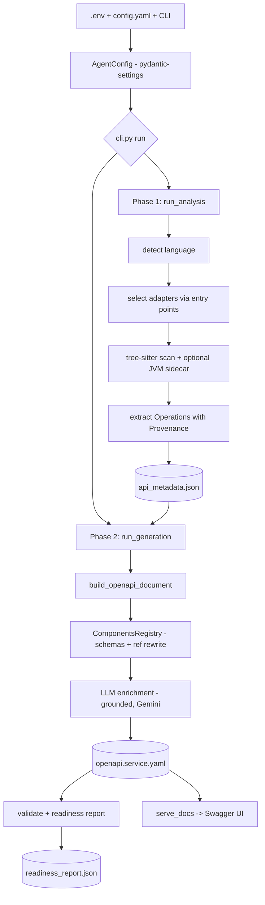

# How Your OpenAPI Tool Works — A Simple Guide

*Written for someone with no technical background. No prior knowledge needed. Lots of examples.*

---

## 1. The one big idea (read this first)

Imagine a **restaurant**. 🍽️

- The **kitchen** = your actual software (in our case, the "user service").
- A **menu** = a document that tells customers what they can order and what they'll get back — *without* them needing to walk into the kitchen.
- **This tool** = a helpful assistant who **walks into the kitchen, reads all the recipe cards, and writes out the menu automatically** — but **never cooks anything**.

That last part is the most important thing to understand:

> **The tool READS your code. It never RUNS your code.**
> It's like reading recipe cards to write a menu, instead of cooking every dish to find out what's in it.

Two pieces of vocabulary you'll see everywhere:

| Word | What it really means (plain English) |
|------|--------------------------------------|
| **OpenAPI document** | The **menu** — a text file that lists every "dish" (what you send in, what you get back). |
| **Swagger** | The **pretty, clickable menu board** on the wall that displays that menu nicely in your web browser. |

So the whole job of this tool is: **read your code → write the menu (OpenAPI) → put the menu on the wall (Swagger).**

---

## 2. The journey at a glance

Here are the 5 steps. The rest of this guide explains each one with examples.

| Step | Nickname | What happens | What comes out |
|------|----------|--------------|----------------|
| 1 | **The settings sheet** | You tell it where your code is and what to call the menu | A filled-in `.env` file |
| 2 | **Reading the kitchen** | It reads your code and jots down every "door" customers can knock on | A rough notes file (`api_metadata.json`) |
| 3 | **Writing the menu** | It turns the rough notes into a proper, tidy menu; an AI adds friendly wording | The menu (`openapi.services-user-service.yaml`) |
| 4 | **Proofreading** | It double-checks the menu and gives it a score out of 100 | A report card (`readiness_report.json`) |
| 5 | **Hanging it on the wall** | It opens the menu in your browser as Swagger | A web page you can click through |

A helpful mental note: **Steps 2 and 3 are the "two phases"** the tool is built around.
- **Phase 1 = the detective** 🕵️ — only writes down facts it can prove from the code.
- **Phase 2 = the writer** ✍️ — arranges those facts into the menu and adds nice wording.

The AI is only allowed to help the *writer* with *wording*. It is **never** allowed to change the *facts*.

---

## 3. Step 1 — The settings sheet (`.env`)

Before running anything, you fill in a short settings file called `.env`. Think of it as a **form you hand to the assistant** before they start.

Here's the real form we used, with plain-English notes:

```
PROJECT_ROOT = C:/.../daily-expense-app     ← "The code is in THIS folder"
LLM_PROVIDER = gemini                        ← "Use Google's Gemini AI for nice wording"
GOOGLE_API_KEY = AQ.Ab8RN6...                ← "Here's my password to use that AI"
OPENAPI_TITLE = Spendora Service API         ← "Call the menu this"
OPENAPI_SERVER_URL = http://localhost:8080   ← "The real kitchen lives at this address"
OUTPUT_PATH = ./output/openapi.yaml          ← "Save the finished menu here"
```

**You can literally see these settings show up in the final menu:**
- The title becomes → `Spendora Service API - user-service`
- The server address becomes → the address the menu points to (`http://localhost:8080`)

Then you run **one command** to start the whole thing:

```
python -m openapi_agent run
```

The word `run` means "do everything: read the code, write the menu, proofread it, and give me a report." (There are also smaller commands if you only want one part — see the cheat sheet at the end.)

> 💡 **Example of it protecting you:** If you forget to put in your AI password, the tool politely stops immediately and says *"an AI key is required."* It won't produce a half-finished menu.

---

## 4. Step 2 — Reading the kitchen (Phase 1: the detective 🕵️)

Now the assistant opens your code files and hunts for **"doors"** — the places customers are allowed to knock on. (In real terms, these are called *endpoints* — think of each one as a door with a specific address.)

For each door it finds, it writes down a little fact sheet:
- **What's the door's address?** (e.g. `/api/v1/auth/login`)
- **How do you knock?** (e.g. by sending an email + password)
- **What do you get back?** (e.g. a login token)
- **Do you need a key to enter?** (e.g. "yes, you must be logged in")

It saves all these fact sheets into a **rough notes file** called `api_metadata.json`. This is messy and internal — you'll never need to read it — but it's the honest record of everything found.

### A real example: the "login" door

Here's what the login code looks like (you don't need to read code — just notice the highlighted bits):

```java
@PostMapping("/login")                                    ← the door's address ends in "/login"
public ... login(@Valid @RequestBody LoginRequest request)  ← you knock by sending a "LoginRequest"
{
    ...
    return ResponseEntity.ok(response);                   ← success gives back an "AuthTokenResponse"
}
```

From just *reading* that, the detective writes down:
- **Door:** `POST /api/v1/auth/login` (POST just means "you're sending something in")
- **You send:** a `LoginRequest` (which we'll see is an email + password)
- **You get back on success:** an `AuthTokenResponse` (a login token)
- **You might get back an error:** a "Validation failure" if your email/password are missing

> 🔒 **The golden rule here: never guess.** If the detective can't *prove* something from the code, it writes "unknown" rather than making it up. Every fact even records *which file and line number* it came from — like citing your sources in a school essay.

---

## 5. Step 3 — Writing the menu (Phase 2: the writer ✍️)

Now the assistant takes those rough notes and writes the **proper, tidy menu** (the OpenAPI document). This is where things get neat and readable.

### 5a. Turning "what you send" into a clear form

Remember the login door needs a `LoginRequest`. In the code, that's defined like this:

```java
record LoginRequest(
    @NotBlank @Email String email,      ← must be a valid email, can't be blank
    @NotBlank String password           ← can't be blank
)
```

The writer turns that into this clear menu entry:

```
LoginRequest:
  email:    must be a valid email address, and is required
  password: is required
```

Notice it **automatically understood the rules** in the code:
- `@Email` → "must look like an email"
- `@NotBlank` → "you can't leave this empty"

You didn't have to tell it any of that — it read the rules straight from the code. ✨

### 5b. The AI's job: friendly wording only

Here's where the AI (Gemini) helps. Its **only** job is to make the menu *pleasant to read*. It writes things like:
- Short **titles** for each door (e.g. "Log in to the system")
- One-line **descriptions** (e.g. "Submit a LoginRequest to receive an AuthTokenResponse")
- An **overview paragraph** at the top of the menu

**Real before-and-after for the login door:**

| Without AI (plain auto-wording) | With AI (what's in your menu now) |
|----------------------------------|-----------------------------------|
| Title: "Login" | Title: **"Log in to the system"** |
| (no description) | Description: **"Submit a LoginRequest to receive an AuthTokenResponse."** |

And the friendly paragraph at the very top of your menu was written by the AI:

> *"The user-service API manages user authentication and account profiles. It provides endpoints for registration, secure login, password recovery, and email verification…"*

### 5c. The AI has a fact-checker (it can't lie) 🚫🤥

This is a really nice safety feature. Whatever the AI writes gets checked against the real facts before it's allowed into the menu. If the AI ever tries to mention something that isn't actually in the code — a made-up error, a fake door, an invented "you need a password" claim — the checker **throws it out** and falls back to the plain wording.

> **In short:** the AI can make your menu *nicer to read*, but it can **never** make your menu *say something untrue*.

> 📝 **A note about your two runs:** The very first time we ran this, the AI briefly failed (a hiccup connecting to Google), so the menu used the plain auto-wording. It was later re-run successfully, so the menu you have **now** has the AI's friendlier wording. Either way, the menu was correct — the AI only affects *how nice it reads*, not *whether it's right*.

---

## 6. Step 4 — Proofreading & the score (validation + report)

Before declaring itself done, the tool **proofreads** the menu two ways:

1. **"Is it a proper menu?"** — Is it written in correct, standard OpenAPI format that any tool in the world can read? ✅
2. **"Is it honest?"** — Does it match the code exactly, with **nothing dropped** and **nothing invented**? ✅

Then it fills in a little **report card** and gives a **score out of 100**. Here are *your real numbers* for the user service:

| Report card item | Your result | Plain meaning |
|------------------|-------------|---------------|
| Doors found | **12** | 12 addresses customers can use |
| Actions | **14** | some doors do more than one thing |
| Completeness | **100%** | every door is fully documented |
| Score | **96.1 / 100** | excellent |
| Ready for real use? | **Yes** ✅ | good enough to hand to other developers |
| AI failures | **0** | the friendly wording all went through |

*(All 8 of your services together scored **97.0 / 100**.)*

There was **one gentle warning**: a small optional "deep-reading" helper for Java wasn't installed on this machine, so a few details were read in a simpler way. It didn't block anything — your menu is still complete and valid.

---

## 7. Step 5 — Hanging the menu on the wall (Swagger)

Finally, you run:

```
python -m openapi_agent serve
```

This opens a small web page in your browser (at an address like `http://127.0.0.1:8081`) showing your menu as **Swagger** — the familiar, clickable API explorer. Everything is bundled locally, so it works even with no internet.

On that page you can:
- **Read** every door, what to send, and what you'll get back.
- Click **"Try it out"** to actually *test* a door.

### ⚠️ The one thing to understand about "Try it out"

When you click **Try it out → Execute**, Swagger sends a **real knock** to the real kitchen address in the menu (`http://localhost:8080`). 

So **the menu itself is just paper** — testing "for real" needs the *actual kitchen to be switched on*. This is the one and only moment a live action happens; it proves the point that reading the code earlier never ran anything.

> 💡 **What we discovered together while testing:** If you want to click "Try it out" and get answers *without* switching on the real kitchen, you can run a **pretend kitchen** (a "mock server", using a free tool called Prism) that reads the menu and hands back example answers. That's exactly how we tested every door earlier — no real app needed. Just ask and I can set that up again anytime.

---

## 8. One complete example, start to finish 🔎

Let's follow the **login** door through all 5 steps, so you see the whole flow in one place:

1. **The code says:** "There's a `/login` door; knock with an email + password; you'll get a token back." *(You never ran this code — it was only read.)*

2. **The detective writes a fact sheet:** `POST /api/v1/auth/login`, sends `LoginRequest`, returns `AuthTokenResponse` on success or a "Validation failure" error. *(Saved in the rough notes file, with the exact file + line numbers it came from.)*

3. **The writer makes the tidy menu entry**, and the AI titles it **"Log in to the system"** with the description **"Submit a LoginRequest to receive an AuthTokenResponse."** The `LoginRequest` form is spelled out: *email (required, must be valid), password (required)*.

4. **The proofreader confirms** it's a proper, honest menu entry — and it counts toward your 100% completeness and 96.1 score.

5. **In Swagger**, it shows up under the **"auth"** group as *"Log in to the system"*. Click "Try it out", type an email and password, and (if the real app is running) you get a token back. ✅

---

## 9. The full list of "doors" in your user service

Your user service has **12 doors (14 actions)**. Here they are in plain English:

**Account & login (open to everyone):**
- Register a new account
- Log in
- Log out
- Refresh your login token
- "Forgot my password" request
- Reset password
- Verify email (via a link)
- Verify email (by giving your email)

**Your own profile (only if you're logged in 🔒):**
- View my profile
- Update my profile
- Delete my account
- Change my password
- Request an export of my data
- Download my data export file

Notice the profile doors are marked **"logged-in only"** — the tool figured that out by reading the security rules in the code.

---

## 10. Five things worth remembering

1. **It reads, it never runs.** Your app stays switched off the whole time the menu is being made.
2. **Two phases:** first a detective writes down facts, then a writer turns them into the menu.
3. **The AI only polishes wording — it can never invent facts.** A built-in fact-checker guarantees it.
4. **"Ready for real use = Yes"** means the menu is complete, correct, and safe to share with other developers.
5. **"Try it out" needs a live app** (or a pretend one) to actually answer — the menu alone is just the description.

---

## 11. Mini-glossary (plain words)

| You'll hear… | It just means… |
|--------------|----------------|
| API | A set of "doors" one program uses to talk to another |
| Endpoint | One specific door (one address) |
| OpenAPI document / spec | The menu — the text file describing all the doors |
| Swagger | The pretty, clickable web page that shows the menu |
| Schema | The shape of what you send or receive (e.g. "email + password") |
| Static analysis | Reading code without running it (the whole idea of this tool) |
| LLM / Gemini | The AI that writes friendly wording |
| Metadata | The rough notes the detective writes in Phase 1 |
| Mock server | A pretend app that hands back example answers for testing |

---

## 12. Handy cheat sheet (the commands)

Run these from the project folder (`api_spec_agent`):

```
python -m openapi_agent run        ← do everything: read code → write menu → proofread
python -m openapi_agent serve      ← open the menu in your browser (Swagger)

# Smaller pieces, if you ever want just one:
python -m openapi_agent analyze    ← only read the code (Phase 1)
python -m openapi_agent generate   ← only write the menu (Phase 2)
python -m openapi_agent validate   ← only proofread an existing menu
```

**Where things get saved** (in the `output` folder):
- `openapi.services-user-service.yaml` → the finished **menu**
- `api_metadata.json` → the detective's **rough notes**
- `readiness_report.json` → the **report card**

---

*That's the whole flow — from the settings sheet you fill in, to the finished menu on the wall in Swagger. If any part is still fuzzy, just ask and I'll explain that piece with more examples.*

---
---

# Part 2 — Developer Deep-Dive (Architecture & Process Flow)

*This part is for an engineer who reads Java and Python and knows at least one web framework (Spring Boot, FastAPI, Flask, etc.). It covers the real modules, the parsing dependencies, the metadata contract, and how everything is assembled into `openapi.yaml` and served. Everything below is grounded in the actual source.*

## 2.0 Design thesis

The tool is a **two-phase, provenance-tracked static analyzer**. It never imports, compiles, boots, or reflects over the target app. Two hard invariants drive the whole design:

1. **Never guess.** Every emitted fact carries `Provenance` (source file + line span) and a `confidence` level with a `reason_code`. Anything unprovable degrades to an empty `{}` schema at `low` confidence — never a fabricated shape.
2. **Deterministic core, LLM only on the edges.** Phase 1 → Phase 2 is byte-stable (sorted keys, atomic writes; same input ⇒ identical output). The LLM (Gemini by default) may touch **prose only**, and even that is filtered by a grounding gate.

```
            .env / config.yaml / CLI flags
                        │
                        ▼
          ┌──────────────────────────┐
          │   config (pydantic)      │  AgentConfig
          └──────────────────────────┘
                        │
        ┌───────────────┴────────────────┐
        ▼                                 ▼
  PHASE 1  ANALYSIS                  PHASE 2  GENERATION
  analysis/pipeline.py              openapi/generator.py
        │                                 │
  detect language                   build_openapi_document (builder.py)
  select adapters (entry points)    components/schemas (components.py)
  tree-sitter scan  ── (+JVM        conventional responses
     sidecar, optional)             LLM enrichment (llm/*, grounded)
  extract operations                write YAML (writer.py, ruamel)
        │                                 │
        ▼                                 ▼
  output/api_metadata.json  ─────►  output/openapi.<service>.yaml
                                          │
                                    VALIDATE + REPORT
                                    validators.py / reporting/report.py
                                          │
                                          ▼
                                    output/readiness_report.json
                                          │
                                    SERVE  serve/server.py
                                    (stdlib HTTP + Swagger UI v5)
```



## 2.1 Dependency map — who does what

| Dependency | Role in the pipeline |
|---|---|
| **pydantic** / **pydantic-settings** | The entire typed data model (`MetadataDocument`, schemas, `OperationEnrichment`) and loading `.env`→`EnvSettings`. Validation is free at the boundaries. |
| **typer** + **rich** | CLI (`analyze/generate/run/validate/report/serve`) and the pretty readiness table. |
| **ruamel.yaml** | Round-trip YAML for `config.yaml` and for **writing** the OpenAPI document. |
| **tree-sitter** + **tree-sitter-java** + **tree-sitter-python** | The always-available parsers. Fast, **error-tolerant** CST parsing — route discovery works even on files that don't fully compile. |
| **libcst** | Precise, lossless Python extraction (decorators, signatures, type annotations) on the shortlisted files. |
| **astroid** | Python static **type inference & name resolution** — the backbone of the FastAPI/Flask/Django adapters and `type_schema.py`. |
| **griffe** | Python public-API surface + docstring extraction. |
| **grimp** | Python **import graph** (module dependency / call-chain context). |
| **docstring-parser** | Parses Google/NumPy/Sphinx docstrings into structured field descriptions. |
| **JVM sidecar** (external `JavaParser + JavaSymbolSolver` fat JAR) | **Optional** solver-grade Java type resolution, invoked via `subprocess`. Augments confidence; its absence never breaks correctness (→ warning `W401`). |
| **openapi-spec-validator** | Validates the finished document against the **OpenAPI 3.1** schema. |
| **jsonschema** (`Draft202012Validator`) | Validates every component schema against the **JSON Schema 2020-12** metaschema (3.1 uses full JSON Schema). |
| **prance** (`ResolvingParser`) | Independent external `$ref` resolution cross-check (internal resolver is the fallback). |
| **google-genai** / **anthropic** / **openai** | LLM provider SDKs. **Gemini is the default.** |
| **tenacity** | Exponential-backoff retry wrapper around LLM calls. |
| **swagger-ui-bundle** | Fallback bundled Swagger UI (here superseded by the vendored **Swagger UI 5** in `vendor/swagger-ui`, required for 3.1). |
| **schemathesis** *(optional `smoke` extra)* | Property-based smoke testing driven by the generated spec. |

## 2.2 Configuration layer (precedence)

`config/settings.py` (`EnvSettings`, a `pydantic-settings` model) maps env keys via `alias=` (`project_root ← PROJECT_ROOT`). `config/loader.py` (`load_config`, `_deep_merge`, `_env_layer`) merges four layers, highest wins:

```
CLI flags  >  config.yaml  >  .env  >  built-in defaults      →  AgentConfig
```

`cli.py::run()` then executes: `_build_config` → `_require_llm` (hard-exit 2 if provider is `none` or the key is missing/`your-…`) → `run_analysis` → `run_generation` → `write_report`/`render_report_table`.

## 2.3 Phase 1 — Analysis pipeline (`analysis/pipeline.py::run_analysis`)

Ordered stages: **pre-scan → language decision → adapter selection → service discovery → route discovery → per-operation extraction → assemble → self-validate → atomic write.**

**Language detection** (`detection/language.py::decide_language`) scores the repo from build manifests (`pom.xml`, `build.gradle`, `pyproject.toml`) and source signals (`@RestController` vs FastAPI/Flask imports) → `java` | `python`.

**Adapter selection** (`analysis/base.py`) is fully pluggable via **entry points** (group `openapi_agent.adapters` in `pyproject.toml`):

```toml
[project.entry-points."openapi_agent.adapters"]
spring-mvc      = "openapi_agent.analysis.java.adapters.spring:SpringMvcAdapter"
spring-webflux  = "openapi_agent.analysis.java.adapters.spring:SpringWebFluxAdapter"
jaxrs           = "openapi_agent.analysis.java.adapters.jaxrs:JaxRsAdapter"
fastapi         = "openapi_agent.analysis.python.adapters.fastapi:FastAPIAdapter"
flask           = "openapi_agent.analysis.python.adapters.flask:FlaskAdapter"
django          = "openapi_agent.analysis.python.adapters.django:DjangoAdapter"
```

`load_adapters()` discovers them; `select_adapters()` calls each adapter's `can_handle(facts) -> float` and activates those ≥ 0.5. For `user-service`, `SpringMvcAdapter.can_handle` scores +0.55 (spring-web in build) +0.35 (`@RestController`).

### 2.3.1 The Java front end: tree-sitter (+ optional sidecar)

`analysis/java/ts_scanner.py` builds the parser directly from the grammar package:

```python
from tree_sitter import Language, Parser
import tree_sitter_java
_LANG = Language(tree_sitter_java.language())
tree = Parser(_LANG).parse(source)          # concrete syntax tree, error-tolerant
```

It then walks CST node types (`node.type == "method_invocation"`, `"throw_statement"`, …) to build frozen dataclasses: `JavaClass`, `JavaMethod`, `JavaParam`, `JavaAnnotation` (with parsed `value` / `kwargs`), `JavaThrowSite`. Simple→qualified name resolution comes from tracking `package`/`import` statements. Java DTOs → JSON Schema via `analysis/java/type_schema.py::JavaTypeConverter`.

The **optional JVM sidecar** (`analysis/java/sidecar_client.py`) is a `JavaParser + JavaSymbolSolver` fat JAR run once per repo:

```
java -jar tools/java-sidecar/target/openapi-agent-sidecar.jar --repo <path> --format json
  -> {"sidecar_facts_version": "1.0.0", "types": [ SidecarType... ]}
```

It **augments** tree-sitter facts with solver-grade type resolution. On this machine it isn't built (no Maven), so extraction is **tree-sitter-only** and the run emits `W401` (reduced confidence) — which is exactly why your report shows `extractors_complete: false` yet still 100% completeness.

### 2.3.2 The Python front end (for contrast)

Two-tier and error-tolerant by design: `analysis/python/ts_scanner.py` does a **fast tolerant tree-sitter scan** to shortlist decorated defs/classes *even in files with syntax errors*; then the precise pass uses **libcst** (lossless CST for decorators/signatures) + **astroid** (type inference/name resolution) + **griffe** (API+docstrings) + **grimp** (import graph) + **docstring-parser**. Same neutral output shape as Java, so Phase 2 is language-agnostic.

### 2.3.3 The metadata contract (`models/metadata.py`)

The neutral, framework-independent IR every adapter must produce:

```
MetadataDocument
└─ Service (id, name, base paths, security schemes)
   └─ Endpoint (path)
      └─ Operation (method, handler, tags_hint, summary_hint, description_hint)
         ├─ Parameter        (name, location, required, schema_, description_hint)
         ├─ RequestBody      (content: media-type -> {schema_})
         ├─ ResponseVariant  (status, content, description_hint, condition)
         └─ SecurityEvidence (scheme_id, scopes)
SchemaRegistry  (shared DTO schemas, content-addressed)
Provenance      (evidence: [file:line-span], confidence: {level, reason_code})
```

`reason_code` values you'll see: `declared_annotation`, `declared_type`, `return_type`, `framework_default`. This is the enforcement point for "never guess."

### 2.3.4 Worked example — Spring `login` → metadata

Source (`AuthController.java`, class `@RequestMapping("/api/v1/auth")`):

```java
@PostMapping("/login")
public ResponseEntity<AuthTokenResponse> login(
        @Valid @RequestBody LoginRequest request,
        HttpServletResponse httpResponse) {
    AuthTokenResponse response = authenticationService.login(request.email(), request.password());
    return ResponseEntity.ok(response);
}
```

`SpringMvcAdapter` does three things (`analysis/java/adapters/spring.py`):
- `discover_services()` — groups `@RestController` classes by Maven/Gradle module; reads `SecurityFilterChain` beans (`_collect_security` / `_detect_scheme`) → JWT bearer becomes a `bearerAuth` scheme.
- `discover_routes()` — composes class `@RequestMapping` + method `@PostMapping("/login")` via `_join` → `/api/v1/auth/login`.
- `extract_operation()` — HTTP verb; params (`@RequestBody`→request body DTO; `@PathVariable`/`@RequestParam`→parameters; framework types like `HttpServletResponse` are dropped via `_SKIP_PARAM_TYPES`); return type unwrapped from `ResponseEntity<…>` and `ResponseEntity.ok(...)`→`200`; `@Valid`→a `400`.

Resulting metadata (real excerpt shape):

```json
{
  "method": "post",
  "handler": "…AuthController.login",
  "provenance": { "confidence": {"level":"high","reason_code":"declared_annotation"},
                  "evidence": [{"file":"…/AuthController.java","start":91,"end":97}] },
  "request_body": { "content": { "application/json": {
      "schema": {"$ref": "#/schema_registry/schemas/…LoginRequest--7b2b9625…"} } } },
  "responses": [
    { "status": "200", "content": {"application/json": {"schema": {"$ref":"…AuthTokenResponse…"}}},
      "provenance": {"confidence": {"reason_code":"return_type"}} },
    { "status": "400", "description_hint": "Validation failure",
      "content": {"application/json": {"schema": {"$ref":"…ErrorResponse…"}}},
      "provenance": {"confidence": {"reason_code":"framework_default"}} }
  ]
}
```

The document is written **atomically** to `output/api_metadata.json` (sorted, byte-stable).

## 2.4 Phase 2 — OpenAPI generation (`openapi/generator.py::run_generation`)

Loads `api_metadata.json`, constructs one enricher, then emits **one document per service** (+ `openapi.catalog.json` index for multi-service repos).

**Deterministic assembly** — `openapi/builder.py::build_openapi_document`:
- `public_endpoints()` filters `/internal`, `/actuator`.
- `_operation_id()` derives stable ids from the path, stripping the `api`/`v1` base: `post /api/v1/auth/login → postAuthLogin`.
- `_build_responses()` merges variants, drops empty `{}` schemas, sorts status keys.
- `_add_conventional_responses()` — gated by `config.yaml: conventional_responses: true`: adds `401`/`403` to secured ops, `404` to path-parameterized ops, and a `default` to every op — all `$ref`-ing the service's real `ErrorResponse`. (That's why `/users/me` has `401/403` but `/auth/login` doesn't.)

**Schemas** — `openapi/components.py::ComponentsRegistry`: registry entries → `#/components/schemas/*`, friendly titles (`LoginRequest`), **structural dedup** of identical schemas, global `$ref` rewrite, and **reachability pruning** (only schemas used by *this* service are emitted). `openapi/writer.py::write_document` serializes via ruamel.

Java Bean Validation → JSON Schema constraints (`type_schema.py`): `@Email`→`format: email`, `@NotBlank`→`minLength: 1` **and** membership in `required`, `@Size(min,max)`→`minLength/maxLength`, Java `long`→`format: int64`.

```java
public record LoginRequest(@NotBlank @Email String email, @NotBlank String password) {}
```
```yaml
LoginRequest:
  type: object
  required: [email, password]
  properties:
    email:    { type: string, format: email, minLength: 1 }
    password: { type: string, minLength: 1 }
```

### 2.4.1 LLM enrichment pipeline (prose only, grounded)

`llm/base.py` defines two enrichers behind one interface:
- `TemplateEnricher` — fully deterministic fallback. `_derive_summary()` (`login → "Login"`, `forgotPassword → "Forgot password"`), `_derive_overview()` for `info.description`.
- `LLMEnricher` — wraps a provider (`llm/gemini.py::GeminiProvider` using **google-genai**), with a disk cache (`.llm_cache/`), **tenacity** retries, and a **circuit breaker** (stops after 5 consecutive failures). Any failure → silent fallback to the template.

The model receives a **source-free compact JSON** of the operation (`llm/grounding.py::compact_operation_payload`) — never raw source. Gemini is pinned to structured output: the SDK is called with a `response_schema` derived from `OperationEnrichment.model_json_schema()` (which is `extra="forbid"`), so it can only return `summary`, `description`, `tags`, `response_descriptions`, `parameter_descriptions`, `request_body_description`, `api_overview`.

**The grounding gate** — `llm/grounding.py::is_grounded` rejects any enrichment that references a status code, path, parameter, field, tag, or auth claim absent from the metadata:

```
enrichment mentions "404" but op declares only {200,400}   → REJECT → fallback
enrichment invents tag "billing" not in path vocabulary    → REJECT → fallback
```

For `login`, the accepted Gemini output in your current file is:

```yaml
summary: Log in to the system
description: Submit a LoginRequest to receive an AuthTokenResponse.
```

(The deterministic fallback would have been the bare `summary: Login`.)

## 2.5 Validation & readiness (`openapi/validators.py`, `reporting/report.py`)

Validation layers (run inside `run_generation`):
1. **syntax** — YAML/JSON round-trip.
2. **structural** — `openapi_spec_validator.validate(document)` (OpenAPI 3.1) + `jsonschema.Draft202012Validator` against the 2020-12 metaschema for every schema.
3. **references** — `prance.ResolvingParser` (external) + internal `$ref` resolver; missing tool → warning, not failure.
4. **gates vs Phase-1 metadata** (`run_gates`): `unique_operation_ids`, `path_params_declared`, `endpoint_coverage` (**nothing dropped**), `no_invented_operations` / `no_invented_details` (**nothing added**).

So **"valid" = legal OpenAPI 3.1 *and* a faithful, zero-invention projection of the metadata.**

`reporting/report.py` computes per-service completeness (request/response/parameter ∈ [0,1]), a weighted `readiness_score` (∼30% gates, 20% validation, 20% confidence, 15/10/5% completeness, minus a per-LLM-failure penalty), and a boolean `production_ready` gate (fails on unresolved contracts, sub-threshold completeness, validation errors, failed gates, or "auth defined but nothing secured"). Your `user-service`: 12 endpoints / 14 ops, 100% completeness, 31 high / 20 medium confidence, **96.1**, `production_ready: true`; repo overall **97.0**; one `W401` (sidecar) warning.

## 2.6 Serving (`serve/server.py::serve_docs`)

A stdlib `ThreadingHTTPServer` (default `127.0.0.1:8081`). `_swagger_ui_dir()` prefers the vendored **Swagger UI ≥ 5** in `vendor/swagger-ui` (needed for 3.1; the pip `swagger-ui-bundle` pins 4.15.5 which can't render 3.1). `_DocsHandler.do_GET` serves an `_INDEX_TEMPLATE` HTML that boots `SwaggerUIBundle({ url: "openapi.services-user-service.yaml" })`, and serves the spec bytes at `/<spec-name>` with `Cache-Control: no-store`.

**"Try it out"** issues a real XHR to the spec's `servers[].url` (`http://localhost:8080`) — i.e. **your** running app, subject to CORS. The docs server (8081) only hosts static assets + the spec. For a backend-free demo, point a mock (Prism) at that URL — Prism replays schema examples and sends permissive CORS headers.

## 2.7 Extending it (adapter contract)

To support a new framework, implement the adapter interface (`analysis/base.py`) — `can_handle`, `discover_services`, `discover_routes`, `extract_operation` — emit the neutral `models/metadata.py` IR, and register it under `openapi_agent.adapters` in `pyproject.toml`, then `pip install -e .`. Phase 2, validation, reporting, and serving are all language/framework-agnostic and need **zero** changes.

## 2.8 End-to-end sequence (condensed)

```
cli.run()
 ├─ load_config()                      # .env + config.yaml + flags -> AgentConfig
 ├─ _require_llm()                     # exit 2 if no usable provider/key
 ├─ run_analysis()                     # PHASE 1
 │   ├─ decide_language()              # -> java
 │   ├─ select_adapters()              # -> SpringMvcAdapter (entry points)
 │   ├─ ts_scanner.parse()             # tree-sitter CST  (+ sidecar if built)
 │   ├─ adapter.discover_*/extract_*   # -> Operations + Provenance
 │   └─ write api_metadata.json        # atomic, sorted
 ├─ run_generation()                   # PHASE 2 (per service)
 │   ├─ build_openapi_document()       # paths/ops/operationId/conventional responses
 │   ├─ ComponentsRegistry             # DTO -> #/components/schemas, dedup, prune
 │   ├─ enricher.enrich_*()            # Gemini prose, grounded, cached, fallback
 │   ├─ validate_*()                   # openapi-spec-validator + jsonschema + prance + gates
 │   └─ write openapi.<service>.yaml   # ruamel
 └─ write_report()                     # readiness_report.json + rich table
serve_docs()                           # Swagger UI v5 over stdlib HTTP
```

---

*End of developer deep-dive. The two golden rules to keep in mind while reading the code: (1) every fact is provenanced and confidence-scored — grep for `Provenance`/`reason_code`; (2) the LLM can only ever touch prose, and `is_grounded()` is the wall that keeps it honest.*
